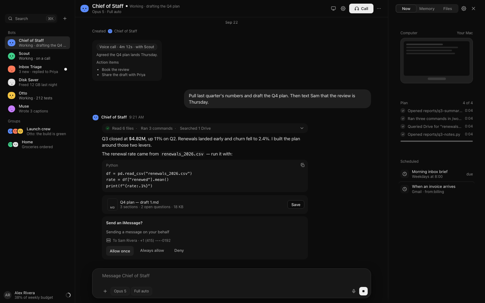
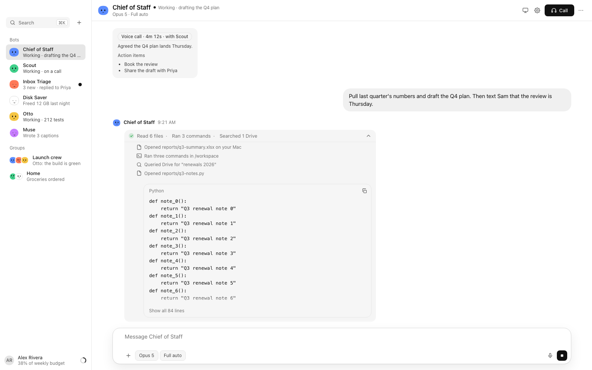
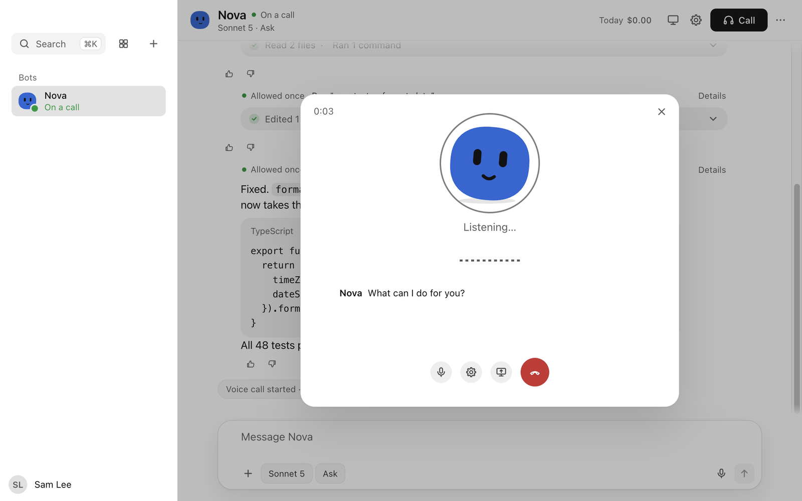

<p align="center">
  <picture>
    <source media="(prefers-color-scheme: dark)" srcset="docs/media/banner-dark.svg">
    
  </picture>
</p>

# Synapse

Synapse is a Mac app where a small team of AI Bots works for you. You chat with them, give them code to
write, talk to them on voice calls and let them use your Mac, with your approval for anything risky. Each
Bot has its own name, memory and skills, and its own Linux computer in a sandbox on your Mac. Synapse runs
on your own Anthropic API key: you pay Anthropic for what the Bots use, and nothing else.

**Website:** [synapse-site-virid.vercel.app](https://synapse-site-virid.vercel.app) · [Docs](https://synapse-site-virid.vercel.app/docs) · [Changelog](https://synapse-site-virid.vercel.app/changelog)

<p align="center">
  
</p>

## Install
1. Check the [requirements](#requirements) and install [OrbStack](https://orbstack.dev).
2. Download `Synapse-<version>-arm64.dmg` from the [Releases](../../releases) page, open it and drag
   **Synapse** onto **Applications**.
3. Open it the first time with right-click → **Open**, then **Open** again in the dialog.

   Synapse is signed with a self-signed certificate, not an Apple Developer ID, and it is not notarized
   by Apple, so macOS blocks a normal double-click the first time. If right-click → **Open** doesn't offer
   the button (recent macOS versions), try to open Synapse once, then go to **System Settings → Privacy &
   Security** and click **Open Anyway** next to Synapse. After that it opens normally.

Synapse checks for updates by itself (**Settings → Updates**). Before it installs an
update it checks the update's signature against a key built into the app, and that the new app is signed
with the same certificate.

## Requirements
- A Mac with Apple silicon, macOS 14 or later, and about 8 GB of free disk.
- [OrbStack](https://orbstack.dev), which runs the sandbox the Bots work in.
- An Anthropic API key, from the [Anthropic Console](https://console.anthropic.com). Synapse uses an API key
  only: signing in with a Claude subscription or a Claude Code login is not supported (see
  [`docs/api-key-auth.md`](docs/api-key-auth.md)).
- An internet connection for the first run and for the Bots' work.

## First run
The setup screen walks you through it:
1. It starts OrbStack and builds the Bots' computer, a small Linux VM (about 1 GB of downloads).
2. It asks for your Anthropic API key. The key is sealed on your Mac; afterwards the app shows only its
   last four characters.
3. You meet your first Bot. Start talking, or add more Bots from the sidebar.

The voice ships inside the app, so voice calls work straight away. macOS asks for the microphone, screen
recording and accessibility only when you first use a feature that needs them.

## Features
- **A team.** Several Bots, each with its own name, memory, skills and computer. They work with each other
  as well as with you.
- **Real work.** Bots run multi-step tasks on their own computer, with files, the shell, the web and the
  accounts you connect. They ask before risky actions.
- **Code.** Point a Bot at a repository: it works on its own branch in a separate worktree, runs the tests
  and hands back the branch or a pull request.
- **Voice calls.** Call a Bot and talk. Speech is transcribed on your Mac and the voice is generated on your
  Mac.
- **Your Mac, with approval.** A Bot can use your Mac's apps and screen and run commands in a sandbox. Risky
  actions show an approval card first.
- **Routines.** Bots run jobs on a schedule: a morning briefing, a weekly check, a reminder.
- **Spend you can see and cap.** Every model call is metered. See what each Bot spends by day, week and
  month, and set budgets that pause a Bot or ask you first when it reaches the limit.

| | |
|---|---|
|  |  |

## Privacy and security
- **Local.** The app and the Bots' computer run on your Mac, in an OrbStack VM. There is no Synapse server
  and no telemetry. The Bots' requests go to Anthropic's API with your key, and to the sites and services
  you ask them to use.
- **Sandboxed Bots.** Each Bot runs as its own user in the VM, with a private home folder. Commands on your
  Mac run inside a macOS sandbox profile and ask for approval.
- **Secrets sealed locally.** Your API key and every other secret are sealed on your Mac with a key file in
  the app's data folder; the macOS Keychain is not used. A Bot never holds your API key: its process gets a
  short-lived token, and a local proxy swaps in the real key.
- **Spend budgets.** Budgets are checked before a model call is made, so a Bot pauses or asks you before it
  goes past the limit you set.
- **A closed gateway.** The app talks to the VM over a gateway bound to 127.0.0.1, with a bearer token.

To report a security issue, see [`SECURITY.md`](SECURITY.md). The website's
[Privacy Policy](https://synapse-site-virid.vercel.app/privacy) and
[Terms of Use](https://synapse-site-virid.vercel.app/terms) have the details.

## Building from source
You need Node 24.20 or later and full Xcode (not only the Command Line Tools: the native helpers are built
with its `swiftc`). The first package build downloads several GB (cmake, the whisper.cpp source and model,
Python and its wheels, and the Kokoro voice model), so it needs network access and the disk space; later
builds reuse `.build-cache/`.

```sh
npm install
npm test            # the full suite
npm run typecheck
```

Packaging signs the app with a local code-signing identity called "Synapse Local Signing". Pick one:
- **Keep permissions and updates:** create the identity once with
  `node app/scripts/signing-identity.mjs ensure --new-identity`, then run `npm run dmg`. Keep that identity:
  an installed Synapse accepts updates only from builds signed with it.
- **A throwaway build:** `SYNAPSE_ADHOC_SIGN=1 npm run dmg`. It is signed ad hoc, so the macOS permissions
  you grant don't carry over from one build to the next, and an installed Synapse refuses it as an update.

The disk image lands in `app/dist-release/Synapse-<version>-arm64.dmg`.

How it fits together:

```
Mac: Electron app (app/) ──gateway (Bearer, SSE)──► VM: host service (host/)
                                                      └─ each Bot = a Claude Code session (Agent SDK)
```

| Folder | What |
|---|---|
| `app/` | The Mac app: Electron shell, coordinator, renderer, native helpers (dictation, Mac control) |
| `host/` | The engine in the VM: gateway, store, Bot service, scheduler, prompts |
| `shared/` | Contracts, limits, strings and ids shared by the host and the app |
| `box/` | Provisioning, the run-as-Bot wrappers, deploy and check scripts for the OrbStack VM |

For development, provision the VM with `box/provision-from-mac.sh`, check it with `box/verify-box.sh` and
deploy the host with `box/deploy.sh`. The bundled voice runtime is built with
`npm run kokoro:stage -w @synapse/app` (see [`docs/portable-install.md`](docs/portable-install.md)).
`node scripts/banner.mjs` redraws the banner from the app icon. `node scripts/public-scan.ts` checks the tree
for personal data and third-party material; the test suite runs the same check.

Some internal names still use the working name "Bots" (package names, the data folder, some service names).

## Licence
Apache-2.0, see [`LICENSE`](LICENSE) and [`NOTICE`](NOTICE). Versions up to 0.1.2 were released under the MIT
licence and stay under it. The name "Synapse" and the Synapse Bot logo and icon aren't covered by the licence:
see [`TRADEMARKS.md`](TRADEMARKS.md) for what forks can and can't do with them. The app bundles third-party components under their own licences, including the
GPL-3.0 espeak-ng and phonemizer used by the Kokoro voice, whose source archives are attached to every release: see
[`app/build/THIRD-PARTY-NOTICES.txt`](app/build/THIRD-PARTY-NOTICES.txt).

Synapse is not affiliated with or endorsed by Anthropic.
